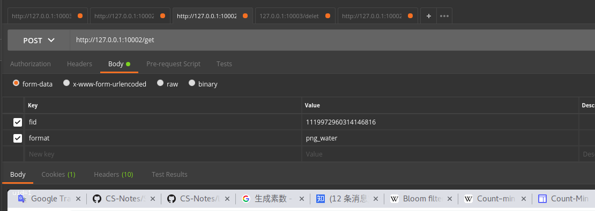

# 毕业设计

## 是什么

异步图片管理网站。

## 怎么做

### 模块

1. write_api: 写 API
2. read_api: 读 API
3. consumer: 消费者

目标：将 CPU 密集型和 IO 密集型逻辑部分由 consumer 完成。

理由：借助消息队列实现削峰。

### 数据存储

状态数据保存在独立组件中，数据存储：
1. 缓存 Redis
2. 持久化元数据存储 MySQL
3. 图片二进制数据存储 HDFS
4. NSQ 消息队列

其中 Redis 同时缓存图片元数据以及二进制数据。

因为将所有数据状态都保存在独立组件中，所以扩展性依赖于 Redis / NSQ / MySQL / HDFS。

### 系统架构


*图中小写组件为本系统设计*

## 如何启动

编译源码：

```bash
sh build.sh
```

通过 docker-compose 启动

```bash
docker-compose build
# 先只启动 mysql，因为其需要设置
docker-compose up -d mysql
```

需要进入 mysql 设置用户以及授权数据库：

进入 mysql 容器：

```sh
➜  graduation git:(master) ✗ docker ps -a | grep 'mysql'
ff7d52c5300a mysql/mysql-server:8.0 "/entrypoint.sh mysq…" 24 minutes ago Up 23 minutes (healthy) 0.0.0.0:3306->3306/tcp, 33060/tcp graduation_mysql_1

➜  graduation git:(master) ✗ docker exec -it ff7d sh

# 已经进入 mysql 容器，进入 mysql client
sh-4.2# mysql -uroot -phello

# 可以添加对登陆 host 做限制
mysql> create user 'g10guang'@'%' identified by 'hello';
Query OK, 0 rows affected (0.02 sec)

mysql> create database oss_meta;

mysql> grant all on oss_meta.* to g10guang@'%';
```

执行 [file.sql](./model/file.sql) 和 [user.sql](./model/user.sql)

启动所有 service:

```bash
docker-compose up -d
```

具体每个模块的日志可以通过：`docker-compose logs [service_name]`查看，或者直接进入容器查看

查看 HDFS 文件系统：

```url
http://127.0.0.1:50070/explorer.html#/
```

查看 nsqadmin：

```url
http://127.0.0.1:4171/
```

### 接口调试

write_api /post 请求：


write_api /delete 请求：


read_api /userFile 请求：


read_api /get 请求：



read_api /meta 请求：


### 技术选型

#### 编程语言 Golang

实习过程中使用 Golang 进行了半年开发，尝到了甜头，整个语言设计非常简单。相对上一次实习使用的 C++ 工作效率有很大的提升，而且 Golang 在开源社区中配套软件越来越丰富，尤其是是在微服务和云计算方面。

#### 分布式存储 HDFS

了解到社区使用分布式存储方案：

1. HDFS
2. [Ceph](https://github.com/ceph/ceph)
3. 将文件二进制数据存储于 MongoDB / MySQL 等数据库
4. 云计算服务商提供的服务

HDFS 被 Hadoop 生态强烈依赖，经过时间的验证，其设计思想是参照 Google File System。HDFS 整个生态很完善，周边开发运维工具也很丰富。

HDFS 有两个主要组成部分：

1. NameNode：维护文件元数据
2. DataNode：处理文件区块的读写请求

因为 NameNode 容易形成单点，在 HA 架构中通常配合 Zookeeper 使用。

HDFS 支持 WebHdfs 提供 Http 接口访问 HDFS，因为开发语言选择 Golang，而 Golang 并没相应的 HDFS 官方 lib，使用 Http 是一个很好的选择，[WebHdfs 文档](https://hadoop.apache.org/docs/r1.0.4/webhdfs.html)

其中 Ceph 支持的功能是最丰富的，包括对象存储、文件存储和区块存储。我了解到字节跳动区块存储和文件存储是通过 Ceph 实现的。但是由于对其不熟悉，不选择。【注：Ceph 已发展了一段时间，周边开发运维工具都比较完善，如果时间更加充裕，我会尝试 Ceph】

MongoDB / MySQL 等数据库提供文件存储的接口，但是不能够将大二进制内容存储进 DB，因为这样会拖垮 DB，尤其是网络/磁盘 IO。在 DB 扩容时，很难将数据迁移到别的机器，增加运维难度。

云存储对于中小型企业，小型网站是一个比较好的选择，将运维工作都托管给云服务提供商，缺点贵，以及切换云服务供应商成本大。

> 为什么我一直强调运维？
> 在大公司实习过一段时间后，发现在大公司做开发是相对轻松的，因为很多基础组件都已经提供好文档，有专人去运维，一般开发不需要麻烦基础组件的运维。以及公司配套了脚手架大大地降低了开发的成本。

#### 消息队列 NSQ

了解到社区常用的消息队列有：

1. Kafka
2. RocketMQ
3. NSQ
4. ZeroMQ

它们各自有不同的定位。

Kafka 定位为高吞吐，它更多应用在日志传递、大数据分析等，而且 Kafka 对消息做了持久化，能够保证消息不会丢失，在同一个 partition 中消息是有序的。但是 Kafka 的时延较高，不适用于实时性处理的场景。

RocketMQ 对于业务功能支持地较为丰富，支持事务型消息，保证消息全局有序，消息重试，消息持久化，在阿里中大面积使用，是一个金融级别的软件，对于复杂的业务场景，使用 RocketMQ 是一个很好的选择。

NSQ 是一个无中心、分布式的消息队列，其主打的场景是低时延，由于 client lib 官方只提供了 python/golang，所以主要用在 python/golang 编写的软件上。由于其消息不做持久化（当消息队列达到一定阈值会做持久化），能够通过增加 nsqd 来达到水平扩容。服务发现组件有 nsqlookupd，提供 admin 界面方便运维。

以上三者都能够应对削峰、异步化的场景。

ZeroMQ 相对奇葩，其是一个 client lib，而不是一个独立的组件。加入生产者需要和消费者通信，生产者运行程序的 lib 直接通过 tcp 或 udp 连接到消费者，然后实现通信，中间没有独立的组件。

以上消息队列对于 Golang client lib 都有很好的支持。最终选择 NSQ 的原因是由于其运维的方便性，以及官方提供了成熟的 lib，实习期间公司大面积使用 NSQ，我对其也有一定的了解。

#### 缓存 Redis

Redis 是一个 key-value 型缓存，提供丰富的数据结构（坦白说通常用不上），在 redis cluster / codis 等方案能够保证其可靠性。因为 Redis 内部使用的字符串不是 C char*，而是一个封装过长度的结构体，所以 Redis 能够缓存二进制内容。对于缓存图片二进制数据是一个很好的选择。

当然缓存还可以使用 Memcache，但是了解到各大社区、公司都在逐渐使用 Redis 替代 Memcache，除了数据结构、分布式解决方案外，Memcache 分配内存是按固定大小分配的，不回收过多的内存，当然这是为了实现简单。当然我也没使过 Memcache，不予考虑。

### 持久化数据库 MySQL

MySQL 是一个非常成熟的关系型数据库，开发运维工具极度丰富，其光彩已掩盖 Oracle。

在一些业务发展较快的组织，即使数据本来就是关系型的，也会采用 MongoDB 作为存储 DB，原因是 MongoDB 更加灵活，支持更加复杂的查询（背后牺牲的是性能），而且原声支持 Replica，分片等运维方案。

在关系型数据库中，我认为 Google Spanner 类数据库是未来的趋势（开源实现有 TiDB），原生支持分布式。通过 Replia 能够方便地做在线数据分析，不再需要 MySQL dump 到 Hive，再做离线数据分析。支持 SQL 降低学习成本。为云计算而生，上云是大趋势，支持强一致性，将逻辑计算和数据存储做了分离，而不是像传统数据库耦合在一起。

### 运维工具 Docker

如果每个软件都得在本地安装，然后迁移过程得一个一个地手动做，过程无疑是痛苦的。

Docker 上有丰富的镜像资源，对于开发测试，使用 Docker 封装好的 Redis、MySQL、NSQ、HDFS 是一个不错的选择，可以通过 docker-compose 进行管理。